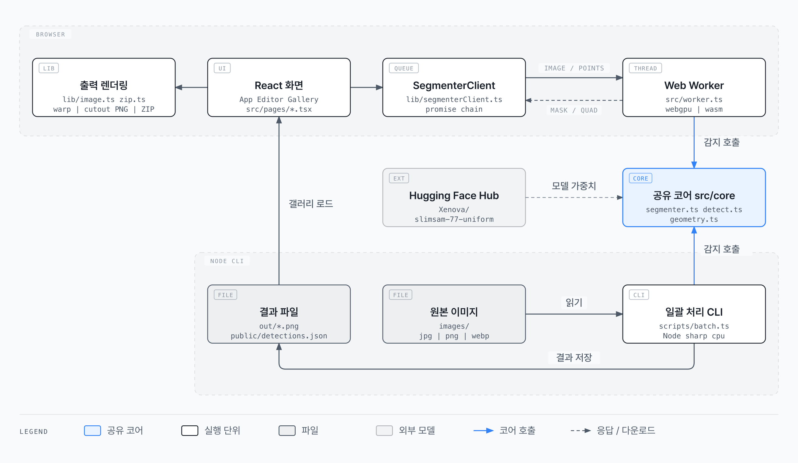
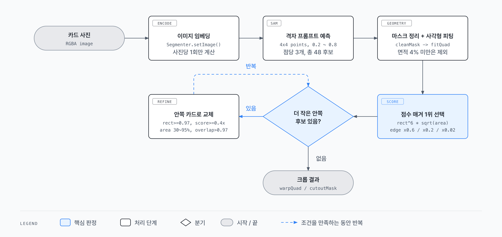
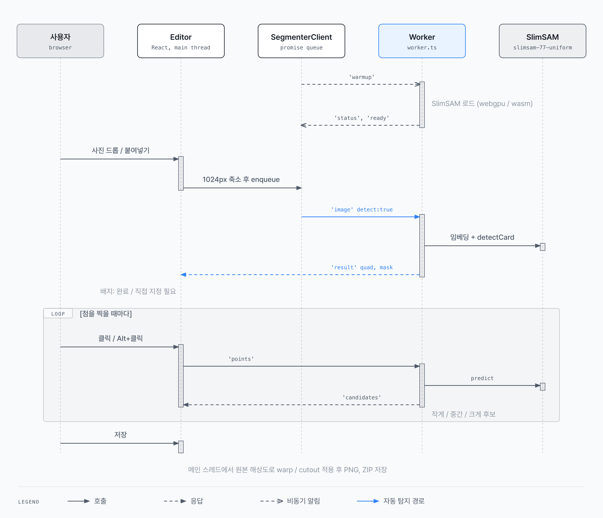

# 카드 자동 크롭 (card-auto-crop)

사진 속 카드(포토카드, 트레이딩 카드, 명함 등)를 찾아서 반듯한 직사각형 이미지로 잘라주는 도구입니다.
세그멘테이션 모델 [SlimSAM](https://huggingface.co/Xenova/slimsam-77-uniform)이 카드 영역 마스크를 만들고, 기하 연산으로 네 꼭짓점을 맞춘 뒤 원근 보정(perspective warp)을 합니다.

- **브라우저 앱**: 사진을 올리면 자동으로 카드를 찾고, 클릭 몇 번으로 영역을 고친 다음 PNG나 ZIP으로 저장합니다. 모델 추론은 전부 브라우저 안(WebGPU 또는 WASM)에서 돌기 때문에 이미지가 서버로 나가지 않습니다.
- **CLI 배치 스크립트**: 폴더 하나를 통째로 처리해서 잘라낸 PNG와 감지 결과 JSON을 만듭니다.

두 경로 모두 같은 코어 코드(`src/core`)를 씁니다.

---

## 목차

1. [빠른 시작](#빠른-시작)
2. [사용법: 브라우저 앱](#사용법-브라우저-앱)
3. [사용법: CLI 배치](#사용법-cli-배치)
4. [아키텍처](#아키텍처)
5. [카드 탐지 알고리즘](#카드-탐지-알고리즘)
6. [에디터와 워커의 통신](#에디터와-워커의-통신)
7. [디렉터리 구조](#디렉터리-구조)
8. [튜닝 포인트](#튜닝-포인트)
9. [한계와 알려진 이슈](#한계와-알려진-이슈)

---

## 빠른 시작

요구 사항: **Node.js 20.19 이상 또는 22.12 이상** (Vite 8 기준)

```bash
pnpm install
pnpm dev        # http://localhost:5173
```

처음 실행하면 모델 파일(약 수십 MB)을 Hugging Face Hub에서 받아옵니다. 브라우저 캐시에 저장되므로 두 번째부터는 바로 뜹니다. 상단 오른쪽 상태 표시에 `모델 준비 완료 (GPU)` 또는 `(CPU)`가 뜨면 준비가 끝난 것입니다.

| 명령 | 설명 |
| --- | --- |
| `pnpm dev` | Vite 개발 서버 실행 |
| `pnpm build` | 타입 체크(`tsc --noEmit`) 후 `dist/`로 빌드 |
| `pnpm preview` | 빌드 결과 미리보기 |
| `pnpm batch -- [입력폴더] [출력폴더] [옵션]` | 폴더 일괄 크롭 |
| `pnpm detect` | `images/`를 감지만 하고 결과를 `public/detections.json`에 저장 (갤러리용) |

---

## 사용법: 브라우저 앱

### 크롭하기 탭

1. **사진 올리기**: 왼쪽 패널에 끌어다 놓거나, 눌러서 선택하거나, `Cmd/Ctrl+V`로 붙여넣습니다. 여러 장을 한 번에 올릴 수 있습니다.
2. **자동 탐지**: 올린 순서대로 큐에 들어가 한 장씩 자동으로 카드를 찾습니다. 목록의 배지가 `대기 중` → `찾는 중` → `완료` 또는 `직접 지정 필요`로 바뀝니다.
3. **영역 고치기** (가운데 캔버스)

   | 조작 | 동작 |
   | --- | --- |
   | 클릭 | 이 지점을 포함하는 영역 선택 (positive point) |
   | `Alt`+클릭 또는 우클릭 | 이 지점을 제외 (negative point) |
   | 꼭짓점 드래그 | 네 모서리 위치 미세 조정 |
   | `작게` / `중간` / `크게` | 클릭으로 나온 후보 마스크 3개 중 선택 |
   | `점 지우기` | 찍은 점 초기화 |
   | `다시 찾기` | 자동 탐지 다시 실행 |

4. **출력 방식 고르기** (오른쪽 패널)
   - `반듯하게 펴기` (warp): 네 꼭짓점을 기준으로 원근을 펴서 직사각형 이미지로 만듭니다.
   - `모양대로 오리기` (cutout): 마스크 모양 그대로 오려내고 나머지는 투명하게 둡니다. 모서리가 둥근 카드에 적합합니다.
5. **저장**: `이 사진 저장`은 현재 사진 한 장을 `<원본이름>_crop.png`로, `전체 ZIP으로 저장`은 완료된 사진 전부를 `cards.zip`으로 내려받습니다.

탐지는 긴 변 1024px로 줄인 이미지에서 하지만, 저장할 때는 **원본 해상도**로 다시 디코딩하고 꼭짓점 좌표를 비율대로 늘려서 자릅니다. 탐지용 축소 이미지를 결과물로 저장하지 않습니다.

### 예시 갤러리 탭

`images/`에 넣어둔 샘플 사진의 자동 탐지 결과를 격자로 보여줍니다. 파란 테두리가 잘라낼 영역, 어둡게 칠해진 부분이 버려지는 영역입니다.

- 먼저 `pnpm detect`로 `public/detections.json`을 만들어야 합니다. 없으면 안내 화면이 뜹니다.
- `확인 필요` 필터: 카드를 못 찾았거나 사각형도(rectangularity)가 0.96 미만인 사진만 모아 봅니다.
- `편집` 버튼을 누르면 그 사진이 크롭하기 탭으로 넘어갑니다.

> 샘플 이미지(`images/*.webp`)와 `public/detections.json`은 `.gitignore` 대상입니다. 저장소에는 `images/.keep`만 있으니 직접 사진을 넣어서 쓰세요. 갤러리는 개발 서버(`pnpm dev`)에서만 동작합니다. 빌드 결과물에는 `images/`가 포함되지 않습니다.

---

## 사용법: CLI 배치

```bash
pnpm batch -- images out            # images/ 전체를 잘라서 out/*.png로 저장
pnpm batch -- images out --debug    # out/debug/*.jpg에 마스크와 사각형을 그린 확인용 썸네일도 저장
pnpm batch -- images out --no-save --json=public/detections.json   # 자르지 않고 감지 결과만 JSON으로
```

| 인자 / 옵션 | 기본값 | 설명 |
| --- | --- | --- |
| 첫 번째 인자 | `images` | 입력 폴더. `.jpg`, `.jpeg`, `.png`, `.webp`만 읽음 |
| 두 번째 인자 | `out` | 출력 폴더 |
| `--debug` | 꺼짐 | 마스크 밖을 어둡게, 사각형을 초록 선으로 그린 400px 썸네일 저장 |
| `--no-save` | 꺼짐 | 크롭 PNG를 만들지 않음 |
| `--json=<경로>` | 없음 | 파일별 `quad`(꼭짓점 4개)와 `rectangularity`를 JSON으로 저장 |

- 이미지는 `sharp`로 읽고 EXIF 회전을 적용합니다. 브라우저와 달리 **축소 없이 원본 해상도 그대로** 모델에 넣습니다.
- 모델은 Node에서 `cpu` 디바이스로 돌기 때문에 한 장에 수 초가 걸릴 수 있습니다. 진행 로그에 장당 점수, 사각형도, 소요 시간이 찍힙니다.

JSON 출력 형식:

```json
{
  "dir": "images",
  "items": [
    {
      "file": "a.webp",
      "width": 1200,
      "height": 1200,
      "quad": [{ "x": 136, "y": 258.6 }, { "x": 1059.7, "y": 260.6 }, { "x": 1058.7, "y": 968.7 }, { "x": 138, "y": 964 }],
      "rectangularity": 1
    }
  ]
}
```

`quad`는 좌상, 우상, 우하, 좌하 순서입니다. 카드를 못 찾으면 `null`입니다.

---

## 아키텍처



[다이어그램 HTML 원본](docs/diagrams/architecture.html)

| 계층 | 파일 | 역할 |
| --- | --- | --- |
| UI | `src/App.tsx`, `src/pages/Editor.tsx`, `src/pages/Gallery.tsx` | 탭 전환, 업로드 목록, 캔버스 편집, 미리보기, 저장 |
| 브라우저 유틸 | `src/lib/image.ts`, `src/zip.ts` | 이미지 디코딩/축소, 출력 렌더링, PNG 인코딩, 무압축 ZIP 생성 |
| 워커 연결 | `src/lib/segmenterClient.ts` | 워커 하나를 감싸고, 요청을 Promise 체인으로 **직렬화**하는 큐 |
| 워커 | `src/worker.ts` | 모델 로딩(WebGPU 우선, 없으면 WASM), 임베딩, 자동 탐지, 점 기반 예측 |
| 코어 | `src/core/segmenter.ts` | transformers.js로 SlimSAM 로딩, 이미지 임베딩 캐시, 점 프롬프트 예측 |
| 코어 | `src/core/detect.ts` | 격자 프롬프트로 후보 마스크 수집, 점수 매기기, 최종 후보 선택 |
| 코어 | `src/core/geometry.ts` | 마스크 정리, 사각형 피팅, 호모그래피 워프, 컷아웃 |
| CLI | `scripts/batch.ts` | Node + sharp로 폴더 일괄 처리 |

설계 포인트:

- **코어는 DOM 의존성이 없습니다.** `src/core`는 `Uint8Array` 마스크와 `RGBAImage`(`{ data, width, height }`)만 다루므로 브라우저 워커와 Node CLI에서 그대로 재사용됩니다.
- **무거운 연산은 전부 워커에서.** 모델 추론과 탐지는 Web Worker에서 돌고, 메인 스레드는 UI와 최종 출력 렌더링만 담당합니다.
- **이미지 임베딩은 한 번만.** SAM은 무거운 이미지 인코더와 가벼운 프롬프트 디코더로 나뉩니다. `setImage`에서 임베딩을 한 번 계산해 두고, 이후 점을 찍을 때마다 디코더만 다시 돌리므로 클릭 반응이 빠릅니다.
- **외부 의존성 최소화.** ZIP은 `src/zip.ts`에서 직접 만들고(무압축 STORE 방식 + CRC32), 원근 보정도 직접 구현했습니다. 런타임 의존성은 `react`, `react-dom`, `@huggingface/transformers` 세 개뿐입니다.

---

## 카드 탐지 알고리즘



[다이어그램 HTML 원본](docs/diagrams/detect-pipeline.html)

`detectCard()`(`src/core/detect.ts`)는 사용자 입력 없이 카드 하나를 고릅니다.

### 1. 격자 프롬프트로 후보 모으기

이미지의 가로/세로 20%~80% 구간에 **4x4 = 16개의 점**을 고르게 찍고, 점마다 SAM에 물어봅니다. SAM은 점 하나에 크기가 다른 마스크 3개를 돌려주므로 최대 48개의 후보가 생깁니다. 카드가 사진 중앙 근처에 있다는 가정을 깔고, 여러 지점을 찔러봐서 한 점이 빗나가도 다른 점이 카드를 잡게 합니다.

### 2. 마스크 정리: `cleanMask()`

- 연결 성분(4방향 flood fill) 중 **가장 큰 덩어리 하나**만 남깁니다.
- 테두리에서 바깥 영역을 flood fill해서, 바깥과 이어지지 않은 **구멍을 채웁니다**. 카드 안쪽의 글자나 그림 때문에 뚫린 부분이 메워집니다.

### 3. 사각형 피팅: `fitQuad()`

1. 마스크 경계 픽셀을 모아 **볼록 껍질**(convex hull, monotone chain)을 구합니다.
2. 인접 세 점이 만드는 삼각형 넓이가 가장 작은 꼭짓점부터 하나씩 지워서 **꼭짓점 4개로 줄입니다**. 이게 대략적인 사각형입니다.
3. 각 변 근처(거리 `max(3, 짧은변 x 2%)` 이내, 양 끝 12%는 제외)의 경계 픽셀을 모아 **변마다 직선을 최소제곱으로 다시 맞추고**, 이웃한 직선의 교점을 새 꼭짓점으로 씁니다. 둥근 모서리 때문에 꼭짓점이 안쪽으로 먹히는 문제를 이 단계가 보정합니다.
4. 보정된 꼭짓점이 대략적인 꼭짓점에서 짧은 변의 10% 이상 벗어나면 보정을 버립니다.
5. **사각형도(rectangularity)** = `min(마스크 넓이, 사각형 넓이) / max(...)`. 1에 가까울수록 마스크가 깔끔한 사각형입니다.

### 4. 점수 매기기: `scoreMask()`

```
score = rectangularity^6 x sqrt(면적 비율) x 테두리 패널티
```

| 조건 | 처리 |
| --- | --- |
| 면적이 이미지의 4% 미만 | 후보에서 제외 |
| 이미지 테두리에 닿은 변 1개 | x 0.6 |
| 2개 | x 0.2 |
| 3개 이상 | x 0.02 (배경 전체를 잡은 마스크를 걸러냄) |

사각형도에 6제곱을 걸어서 "크지만 모양이 흐트러진 마스크"보다 "조금 작아도 반듯한 사각형"이 이기게 합니다. 테두리 판정은 한 변 길이의 5% 넘게 마스크가 닿았는지로 봅니다.

### 5. 안쪽 카드로 좁히기

점수 1등을 고른 뒤, 아래 조건을 모두 만족하는 후보가 있으면 그 후보로 바꾸고 다시 반복합니다.

- 사각형도 0.97 이상
- 점수가 현재 1등의 40% 이상
- 넓이가 현재 1등의 30% 이상, 95% 미만
- 마스크의 97% 넘게 현재 1등 안에 들어감

슬리브나 탑로더, 케이스에 끼운 카드를 찍으면 바깥 케이스가 더 크고 반듯해서 1등이 되기 쉽습니다. 이 단계가 "케이스 안에 있는 더 작은 사각형"을 따라 안쪽으로 들어가서 실제 카드를 고르게 합니다.

### 6. 출력

- **warp** (`warpQuad`): 목표 직사각형 크기는 마주 보는 두 변 길이의 평균입니다. 8x8 연립방정식을 가우스 소거로 풀어 호모그래피를 구하고, 출력 픽셀마다 원본 좌표를 역산해 쌍선형 보간으로 샘플링합니다.
- **cutout** (`cutoutMask`): 마스크의 바운딩 박스만큼 잘라내고, 마스크 밖 픽셀의 알파를 0으로 만듭니다.

---

## 에디터와 워커의 통신



[다이어그램 HTML 원본](docs/diagrams/editor-sequence.html)

메시지 타입은 `src/worker.ts`에 정의돼 있습니다.

| 방향 | 타입 | 내용 |
| --- | --- | --- |
| 메인 → 워커 | `warmup` | 앱 시작 시 모델 로딩만 미리 시작 |
| 메인 → 워커 | `image` | 축소된 RGBA 픽셀 + `detect` 여부. 임베딩 계산 후 `detect: true`면 자동 탐지까지 |
| 메인 → 워커 | `points` | 정규화 좌표(0~1)의 점 목록과 label(1 포함, 0 제외) |
| 워커 → 메인 | `status`, `ready` | 다운로드 진행률, 사용 디바이스 |
| 워커 → 메인 | `embedded` | 탐지 없이 임베딩만 끝났을 때 |
| 워커 → 메인 | `result` | 자동 탐지 결과 `quad`, `mask` (못 찾으면 `null`) |
| 워커 → 메인 | `candidates` | 점 기반 후보 마스크 최대 3개와 기본 선택 인덱스 |
| 워커 → 메인 | `error` | 예외 메시지 |

동작 규칙:

- **요청은 한 번에 하나.** 워커는 이미지 임베딩을 하나만 들고 있으므로, `SegmenterClient.enqueue()`가 모든 작업을 Promise 체인으로 줄 세웁니다. 여러 장을 올려도 순서대로 처리됩니다.
- **임베딩 재사용.** `loadedId`로 워커에 지금 올라가 있는 이미지를 추적합니다. 다른 사진에서 점을 찍으면 먼저 `image`(`detect: false`)로 임베딩을 다시 만든 뒤 `points`를 보냅니다.
- **후보 기본 선택.** `candidates`를 만들 때도 `scoreMask()` 점수가 가장 높은 후보를 기본으로 골라서, 대부분의 경우 크기 버튼을 누를 필요가 없습니다.
- **저장은 메인 스레드에서.** 원본 해상도 디코딩, 워프/컷아웃, PNG 인코딩, ZIP 생성은 `OffscreenCanvas`를 써서 메인 스레드에서 처리합니다.

---

## 디렉터리 구조

```
card-auto-crop/
├── index.html                 # 앱 진입 HTML (Pretendard 폰트 로드)
├── vite.config.ts             # 워커 ES 모듈 포맷, transformers.js 사전 번들 제외
├── scripts/
│   └── batch.ts               # CLI 일괄 처리
├── src/
│   ├── main.tsx               # React 루트
│   ├── App.tsx                # 상단 바, 탭(크롭하기 / 예시 갤러리), 상태 표시
│   ├── worker.ts              # Web Worker: 모델 로딩, 탐지, 점 예측
│   ├── zip.ts                 # 의존성 없는 ZIP(STORE) 생성기
│   ├── styles.css             # 라이트/다크 테마 토큰과 레이아웃
│   ├── core/                  # 브라우저와 Node가 공유하는 순수 로직
│   │   ├── segmenter.ts       # SlimSAM 래퍼
│   │   ├── detect.ts          # 자동 탐지와 점수 계산
│   │   └── geometry.ts        # 마스크 정리, 사각형 피팅, 워프, 컷아웃
│   ├── lib/
│   │   ├── image.ts           # 디코딩, 출력 렌더링, PNG, 다운로드
│   │   └── segmenterClient.ts # 워커 래퍼 + 직렬화 큐
│   └── pages/
│       ├── Editor.tsx         # 업로드 목록, 캔버스 편집, 미리보기, 저장
│       └── Gallery.tsx        # detections.json 기반 결과 격자
├── docs/diagrams/             # README 다이어그램 (HTML 원본 + PNG)
└── images/                    # 샘플 이미지 폴더 (내용은 git 제외)
```

---

## 튜닝 포인트

탐지 품질을 바꾸고 싶을 때 손댈 곳입니다.

| 값 | 위치 | 기본값 | 효과 |
| --- | --- | --- | --- |
| `MODEL_ID` | `src/core/segmenter.ts` | `Xenova/slimsam-77-uniform` | 더 큰 SAM 계열로 바꾸면 정확도가 오르고 속도가 떨어짐 |
| `grid` | `detectCard()` 인자 | `4` | 프롬프트 격자 크기. 늘리면 작은 카드를 더 잘 잡지만 느려짐 (호출 수 = grid²) |
| 최소 면적 비율 | `scoreMask()` | `0.04` | 이보다 작은 마스크는 버림 |
| 사각형도 지수 | `scoreMask()` | `6` | 클수록 반듯한 모양을 강하게 선호 |
| 테두리 패널티 | `scoreMask()` | `0.6 / 0.2 / 0.02` | 사진 가장자리에 닿은 마스크 감점 |
| 안쪽 좁히기 조건 | `detectCard()` | `0.97 / 0.4 / 0.3~0.95 / 0.97` | 케이스 속 카드 선택 민감도 |
| `PROC_MAX` | `src/lib/image.ts` | `1024` | 브라우저 탐지용 축소 크기. 키우면 정확도와 메모리 사용이 함께 늘어남 |
| `CHECK_THRESHOLD` | `src/pages/Gallery.tsx` | `0.96` | 갤러리에서 `확인 필요`로 분류할 사각형도 기준 |

---

## 한계와 알려진 이슈

- **한 장에 카드 하나.** `detectCard()`는 가장 그럴듯한 카드 하나만 돌려줍니다. 여러 장이 찍힌 사진은 점을 찍어서 하나씩 지정해야 합니다.
- **중앙 가정.** 프롬프트 격자가 20%~80% 구간에만 있어서, 사진 구석에 작게 찍힌 카드는 놓칠 수 있습니다.
- **배경과 카드 색이 비슷하면** 마스크가 배경으로 번집니다. 이때는 `Alt`+클릭으로 배경을 제외하세요.
- **CLI는 CPU 추론**이라 느립니다. 원본 해상도로 처리하므로 큰 사진일수록 더 오래 걸립니다.
- **ZIP은 무압축**입니다. PNG 자체가 압축돼 있어서 실제 용량 차이는 거의 없습니다.
- 모델 첫 다운로드에는 인터넷 연결이 필요합니다. 이후에는 브라우저 캐시에서 불러옵니다.
